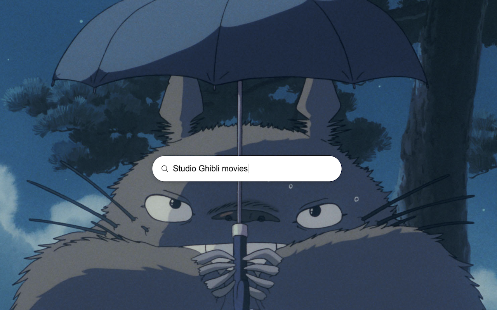

# Studio Ghibli Browser Extension

[](https://chrome.google.com/webstore/detail/studio-ghibli-new-tab/fmdejajfcfdnbbanalgjibhcgbhihphd)
[](https://chrome.google.com/webstore/detail/studio-ghibli-new-tab/fmdejajfcfdnbbanalgjibhcgbhihphd)
[](/LICENSE)
[](https://github.com/prettier/prettier)

Browser extension designed to showcase still shots from Studio Ghibli films. 



### Development

#### Requirements
* Node v14 (built with 14.18.2)
* Python 3 (built with 3.7.3)

<!-- #### Setup

```
git clone <url>
npm i
pip3 install -r requirements.txt
``` -->

#### Scripts
* `start`: runs the app in development mode
* `build`: builds the app for production, including scraping the Studio Ghibli website for still shots and compressing the extension files

### Acknowledgments
* __Designed with images retrieved from__ [Studio Ghibli](https://www.ghibli.jp/)
* __Developed with the inspiration of__ Kate Jones
